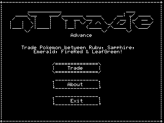

# nTrade Advanced

A program for the [Ti-Nspire](https://education.ti.com/en/us/products/calculators/graphing-calculators/ti-nspire-cx-cas-handheld/), which allows you to trade Pokemon between the third generation Pokemon games _(FireRed, LeafGreen, Ruby, Sapphire & Emerald)_

Also available for Mac OS, Linux and Windows if you want to try it out.

The original version from 2016 is still available on [this branch](../../tree/master).

## Screenshots

[ More screenshots!](./screenshots)

## Requirements

[Ndless](http://ndless.me/) is required.

Ndless 3.1 is known to be incompatible and 4.5.4 is known to be compatible.
Aside from that, I don't know which Ndless versions are compatible with nTrade Advance, but my guess is anything >= 3.9 will probably work.
If you have an older version of Ndless, you can still use [v1.0.0](https://github.com/ciriousjoker/nTradeAdvance/releases/tag/1.0.0) of nTrade Advance, which is compatible with Ndless 3.1 - 4.2.

## How to use

1. Install [ndless](https://github.com/ndless-nspire/Ndless)
2. Transfer nTradeAdvance.tns to your calculator
3. Move your savefiles to the root directory of your calculator
4. Open the program & trade the Pokémon you want

### Demo savestates

You can download ReignOfComputer's collection of Gen III savestates from the following links:

- [Ruby, Sapphire, Emerald](https://github.com/ReignOfComputer/RoCs-PC/tree/master/05%20-%20Gen%20III%20-%20RSE%20Collection/Save%20Data)
- [FireRed, LeafGreen](https://github.com/ReignOfComputer/RoCs-PC/tree/master/06%20-%20Gen%20III%20-%20FRLG%20Collection/Save%20Data)

### Troubleshooting

If any of your pokemon have mails attached, remove them before trading.

> [!WARNING]
> Some emulators add rtc data to the save files, which can cause issues when trading.
> You can fix this by using mGBA and then `File->Save games->Convert save game...`.
> This converts the 131kib save file to a 128kib save file, which should be compatible with nTrade Advance.

If anything is still not working, note that nTrade Advance uses [pkmn-savedata](https://codeberg.org/AyashiBox/pkmn-savedata) under the hood,
so there's a good chance that the issue belongs in the repository over there.
Either way, please create an issue in this repository and I'll see if I can be of any help.

## Related links

- [The omnimaga thread](http://www.omnimaga.org/ti-nspire-projects/ntrade-an-on-calc-trading-program-for-3-gen-pokemon-games)
- [The tiplanet.org download page](https://tiplanet.org/forum/archives_voir.php?id=86503&lang=en)
- [My author page on ndless-apps.org](https://ndless-apps.org/authors/50)

## License

The source code for [nTrade Advance](https://github.com/ciriousjoker/nTradeAdvance) © 2025 by Philipp Bauer is licensed under [CC BY-NC-SA 4.0](https://creativecommons.org/licenses/by-nc-sa/4.0/). The icon is not covered by this license.
